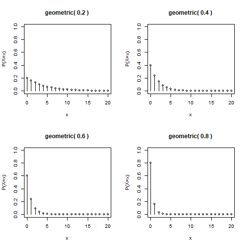
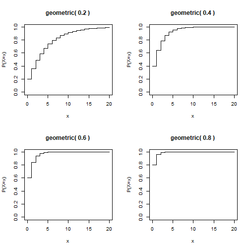

### Text

* A string of characters is said to be of mode character.
* Character strings are denoted by either double quotes " " or single quotes ' '.
* Strings can be arranged into vectors and matrices just like numbers.
* We can paste string using ```paste(..., sep)```.


```r
x <- "Citroen SM"
y <- "Jaguar XK150"
z <- "Ford Falcon GT-HO"
(wish.list <- paste(x, y, z, sep=", "))
```

```
## [1] "Citroen SM, Jaguar XK150, Ford Falcon GT-HO"
```

* Special characters with the escape character ```\```.
  * ```\n``` for newline, ```\t``` for tab, ```\b``` for backspace, ```\"``` for ```"```, ```\\``` for ```\```
* If a character string can be understood as a number, the ```as.numeric(x)``` is used.

```r
as.numeric("10.1")
```

```
## [1] 10.1
```
* Use ```as.character(x)``` to coerce a number into a character string.

```r
as.character(10.1)
```

```
## [1] "10.1"
```

```paste0(..., )``` is equivalent to ```paste(..., sep = "", )```, slightly more efficiently.


```r
paste0("a","b","c")
```

```
## [1] "abc"
```


```r
paste("a","b","c")
```

```
## [1] "a b c"
```

### Input from a file

* R provides a number of ways to read data from a file.
  * ```scan``` function is the most flexible one.
  * ```scan``` to read a vector of values from a file.
* ```scan(file= "", what=0, n=-1, sep="", skip=0, quiet=FALSE)```
  * all parameters are optional 
  * file gives the file to read from. 
    * The default ```" "``` indicates read from the keyboard.
  * what gives an example of the mode of data to be read.
    * use ```0``` for numeric value, use ```" "``` for character data.
  * ```n``` gives the number of elements to read.
    * if ```n = -1``` then scan keeps reading until EOF.
  * ```sep``` allows you to specify that is used to separate values such as ","
  * ```skip``` is the number of lines to skip before start reading.
  * ```quiet``` controls whether or not scan reports how may values it has read.
  
#### Example : file input


```r
# You need to change the path of the file accordingly.
data <- scan(file="data/data1.txt")
n <- length(data)
data.sort <- sort(data)
data.1qrt <- data.sort[ceiling(n/4)]
data.med <- data.sort[ceiling(n/2)]
data.3qrt <- data.sort[ceiling(3*n/4)]
cat("1st Quartile:", data.1qrt, "\n")
```

```
## 1st Quartile: 2
```

```r
cat("Median:      ", data.med, "\n")
```

```
## Median:       4
```

```r
cat("3rd Quartile:", data.3qrt, "\n")
```

```
## 3rd Quartile: 7
```

By using the built-in function quantile

```r
quantile( scan("data/data1.txt"), (0:4)/4 )
```

```
##   0%  25%  50%  75% 100% 
## 0.00 2.25 4.50 6.75 9.00
```

### Input from the keyboard

* ```scan``` can be used to read from the keyboard if ```file``` is ```""```.


```r
scan(file="", what="")   # character input
scan(file="", what=0)   # numeric input
```

* ```readline(prompt)``` read a single line of text from the keyboard.
   * ```prompt``` (default "") : takes the optional character input


```r
your_name <- readline("Input your name : ")
```

#### Example : Root of quadratic


```r
cat("find zeros of a2*x^2 +a1*x +a0 = 0\n")
a2 <- as.numeric(readline("a2= "))
a1 <- as.numeric(readline("a1= "))
a0 <- as.numeric(readline("a0= "))
discrim <- a1^2 - 4*a2*a0

if (discrim > 0) {
  roots <- (-a1 + c(1,-1) * sqrt(a1^2 - 4*a2*a0))/(2*a2)
} else if (discrim == 0) {
  roots <- -a1/(2*a2)
} else {
  roots <- c()
}

if (length(roots) == 0){ 
  cat("no root\n") 
} else if (length(roots)==1){ 
  cat("single root at", roots, "\n")
} else{  
  cat("roots at", roots[1], "and", roots[2], "\n")
}
```


### Output to a file

* Generally use ```write``` or ```write.table``` for writing numeric.
* ```cat``` for writing text, or a combination of numeric and text.

* ```write(x, file = "data", ncolumns = if(is.character(x)) 1 else 5, append = FALSE)```
   * ```x``` is the vector to be written.
      * If ```x``` is a matrix then it is converted to a vector (column by column)
   * ```file``` gives the file to write as a character string
      * default ```"data"``` writes to a file called data in the current working directory
      * to write to the screen use ```file=""```
   * ```ncolumns``` : the number of columns to write the data in.
   * ```append``` indicates whether to append to or overwrite the file.
   
* ```write``` converts matrices to vectors
* Since R stores its matrices by column, you should transpose the matrix to ```write``` if you want the output to reflect the matrix structure.


```r
( x <- matrix(1:24, nrow=4, ncol=6)) 
write(t(x), file = "out.txt", ncolumn=6)
```

### cat for writing to a file

* ```cat``` is more flexible command.
* ```cat(..., file="", sep="", append=FALSE)```
   * ```...``` is a list of expressions (separated by commas) that are coerced into character strings, concatenated, and then written.
   * ```file``` gives the file to write or append to as a character string.
      * the default ```""``` writes to the screen.
   * ```sep``` is character string that is inserted between objects.
   * ```append``` indicates whether to append to or overwrite the file.
   
### dump
* ```dump``` creates a text representation of almost any object that can subsequently read by ```source```.


```r
x <- matrix(rep(1:5, 1:5), nrow=3, ncol=5)
dump("x", file="result.txt")
rm(x)
source("result.txt")
x
```

```
##      [,1] [,2] [,3] [,4] [,5]
## [1,]    1    3    4    4    5
## [2,]    2    3    4    5    5
## [3,]    2    3    4    5    5
```

### Plotting

* We have already seen ```plot(x, y, type)```.
* To add points to the current plot, use ```points(x, y)```.
* To add lines, use ```lines(x, y)```.
* To add vertical or horizontal liens, use ```abline(v=xpos)``` or ```abline(y=ypos)```.
* ```points``` and ```lines``` take optional input ```col```, which determines color.
  * ```colors()``` show the complete list of colors.
* To add text ```labels[1]``` at ```(x[i], y[i])```, use ```text(x, y, lables)```.
  * ```pos``` is used to indicate the position. (See ```help(text)```)
* ```title(main)``` for the title (```main``` is a character string).


#### plotting a parabola $y^2=4x$


```r
x <- seq(0, 5, by=0.01)
y.upper <- 2*sqrt(x)
y.lower <- -2*sqrt(x)
y.max <- max(y.upper)
y.min <- min(y.lower)
plot(c(-2,5), c(y.min, y.max), type="n", xlab="x", ylab="y")
lines(x, y.upper)
lines(x, y.lower)
abline(v=-1)
points(1,0)
text(1, 0, "focus (1, 0)", pos=4)
text(-1, y.min, "directrix x = -1", pos=4)
title("The parabola y^2 = 4*x")
```



#### more than one plots

* ```windows()``` open additional graphics devices.
* ```par(mfrow = c(nr, nc))``` or ```par(mfcol = c(nr, nc))``` creates a grid of plots.
   * ```mfrow = c(nr, nc))``` : with ```nr``` rows and ```nc``` columns, filled row by row.
   * ```mfcol = c(nr, nc))``` : filled column by column.


```r
par(mfrow=c(2,2))
curve(x*sin(x), from=0, to=100, n=1001)
curve(x*sin(x), from=0, to=10, n=1001)
curve(x*sin(x), from=0, to=1, n=1001)
curve(x*sin(x), from=0, to=0.1, n=1001)
```



