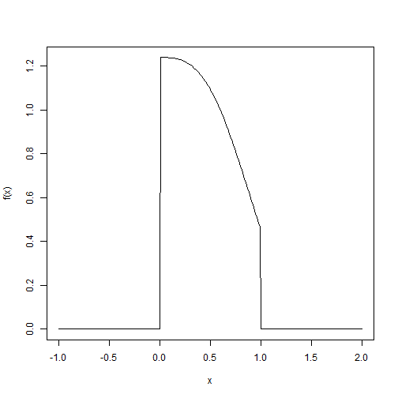
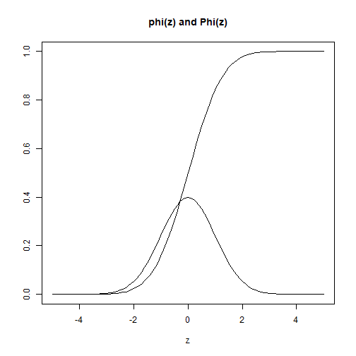

## Numerical integration

* It is frequently necessary to compute

    * 

* If we know the antiderivative F, then

    * 

* However for many function f, we don't know the closed form of antiderivative.

* We approximate the integral on the divided subinterval:

    * 

## Trapzoidal rule

* Approximating the are under y=f(x) over the subinterval [x_i, x_(i+1)] by a trapezoid.


* The area of each trapezoid:
    * 
    
* Trapezoidal approximation:
    * 


```r
trapezoid <- function(ftn, a, b, n = 100) {
  h <- (b-a)/n
  x.vec <- seq(a, b, by = h)
  f.vec <- sapply(x.vec, ftn)
  T <- h*(f.vec[1]/2 + sum(f.vec[2:n]) + f.vec[n+1]/2)
  return(T)
}
```


```r
ftn6 <- function(x) return(4*x^3)
trapezoid(ftn6, 0, 1, n=20)
```

```
## [1] 1.0025
```


## Simpson's rule

* Simpson's rule subdivides the interval [a,b] into n (even) subintervals

* and approximate f by a parabola (polynomial of degree 2).


* As an approximation to the area, we use


* Now assuming n is even, we add up the approximation for subintervals ```[x_2i, x_(2i+2)]``` to obtain Simpson's approximations ```S```.


* Notice that the ```f(x_i)``` for ```i``` odd are all weighted 4, while the ```f(x_i)``` for ```i``` even (except 0 and n) are weighted 2.


```r
simpson_n <- function(ftn, a, b, n = 100) {
  n <- max(c(2*(n %/% 2), 4))
  h <- (b-a)/n
  x.vec1 <- seq(a+h, b-h, by = 2*h)
  x.vec2 <- seq(a+2*h, b-2*h, by = 2*h)
  f.vec1 <- sapply(x.vec1, ftn)
  f.vec2 <- sapply(x.vec2, ftn)
  S <- h/3*(ftn(a) + ftn(b) + 4*sum(f.vec1) + 2*sum(f.vec2))   # return value
  return(S)
}
```

* Example


```r
ftn6 <- function(x) return(4*x^3)
simpson_n(ftn6, 0, 1, 20)
```

```
## [1] 1
```

* Example


```r
f <- function(x) {
  if (0 < x & x < 1) 1/simpson_n(function(x) exp(-x^3), 0, 1)*exp(-x^3)
  else 0
}

plot(seq(-1,2,0.01), sapply(seq(-1,2,0.01), f), xlab="x", ylab="f(x)", 'l')
```



* compute the mean


```r
(m <- simpson_n(function(x) x*f(x), 0, 1))
```

```
## [1] 0.4317833697819384
```

* compute the variance


```r
simpson_n(function(x) (x-m)^2*f(x), 0, 1)
```

```
## [1] 0.07192550186879515
```

### pdf and cdf of the standard normal

Consider the probability density function and cumulative distribution of standard normal.


```r
phi <- function(x) return(exp(-x^2/2)/sqrt(2*pi))
Phi <- function(z) {
	if (z<0) {
	  return(0.5 - simpson_n(phi, z, 0))
	} else {
    return(0.5 + simpson_n(phi, 0, z))
	}
}
z<- seq(-5, 5, by = 0.1)
phi.z <- sapply(z, phi)
Phi.z <- sapply(z, Phi)
plot(z, Phi.z, type  ="l", ylab="", main="phi(z) and Phi(z)")
lines(z, phi.z)
```



